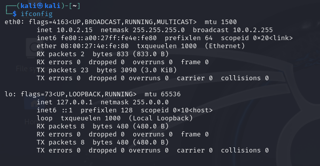
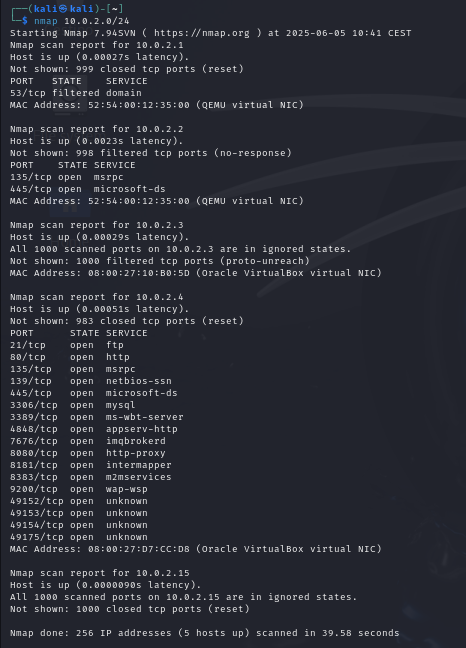
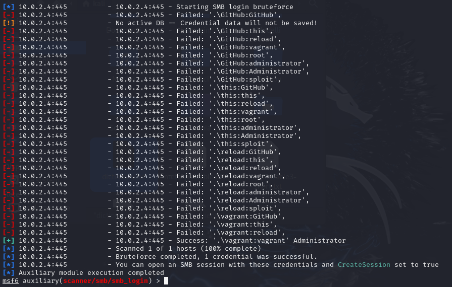
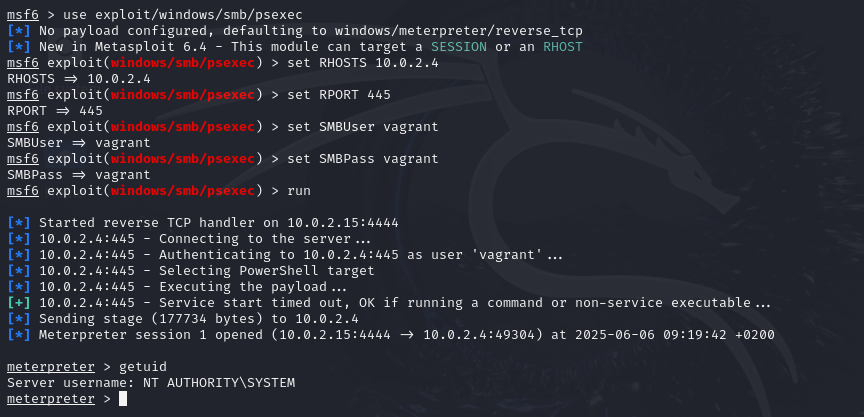
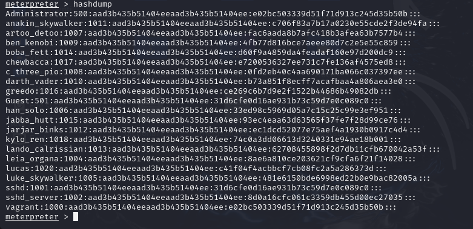
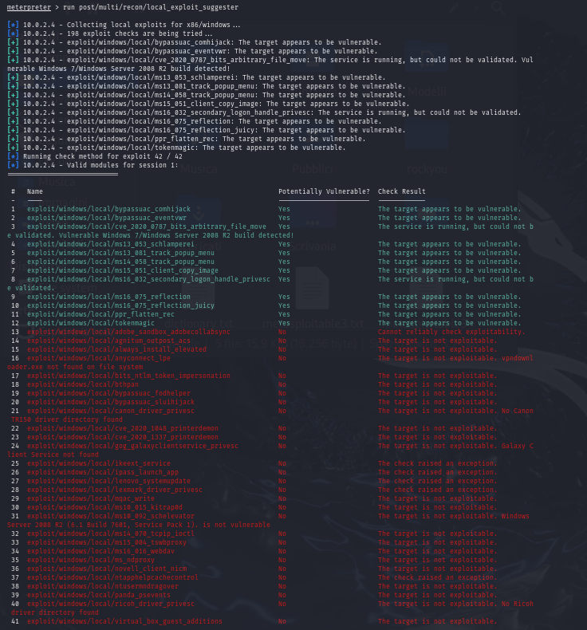

# CyberSecurity Report: Pen testing and vulnerability exploitation on Metasploitable3

## Introduction

In this project I examine a practical penetration testing exercise during which a series of controlled attacks steps were carried out within a test environment. These steps represent a variation of some lab activities proposed in the *Hacking Lab* section of the course website. Two virtual machines are used, more specifically **Metasploitable3** is used as the target machine and **Kali Linux** as the attacking machine. 

This setup allows the simulation of a realistic environment in which an attacker could attempt to compromise a target system.

##### **Threat model:**
  * Virtual machines are connected to the same network
  * Victim can log on to Metasploitable2 machine using **Valid Credentials**
  *

## Reconnaissance

As a first step, we need to determine our own(attacker) IP address and netmask in order to define the scope of the scan and discover available IP addresses that could potentially be targeted. This can be done by opening a terminal in the Kali Linux machine and executing the `ifconfig` command (*Fig. 1*). 

##### **Result:** 
We found out that the attacker machine has an IP address of 10.0.2.15 and a subnet mask of 255.255.255.0. This result indicates that the first 24 bits are used to identify the **network portion**, while the remaining 8 bits are allocated for the **individual hosts** within the network. This network can be represented as 10.0.2.0/24, meaning that the address range can cover all IP addresses from 10.0.2.1 to 10.0.2.254.



<br>

In order to determine which hosts are connected to this network we can execute `nmap 10.0.2.0/24`.

##### **Result:** 
As a result, multiple IP addresses were detected. This might have occured because the environment and both the machines were tested while the system was connected to a mobile hotspot via a smartphone. The active host at `10.0.2.4`, which has multiple open ports, is identified as our target machine(*Fig. 2*).




<br>


We can also perform a full scan on the target to gather as much information as possible,getting details about the running services, their versions and other additional information. This is done by using `nmap -sV -p- 10.0.2.4`, where:

  * **-sV:** Tells *Nmap* to perform service/version detection
  * **-p-:** It allows scanning all 65.535 ports, instead of just most commonly used ports.


## Initial access

Now that we have identified the IP address of the target machine, we can attempt to gain access by impersonating a legitimate user. One common method is to connect to the system via its SSH service using valid user credentials. However, this approach is not viable in our case, as there is no SSH service running on port 22 (*Fig. 2*), which prevents us from establishing any SSH connection with the target machine.

An alternative method for gaining initial access is to perform a brute-force attack against the SMB service(running on port 445) using a dictionary of usernames and passwords to obtain valid credentials. **SMB** is a network protocol used for sharing resources between computers. It operates on a client-server model and includes mechanisms for both user authentication and authorization.

##### **Dictionary creation:**
  First thing first, we need to construct a dictionary that can be obtained from the target's configuration page content. We do this by using the following command: `cewl -d 0 -w dictionary.txt https://github.com/rapid7/metasploitable3/wiki/Configuration`, which crawls a given web page and extracts useful words to build a dictionary file.
  
For the purposes of this project, to reduce the time required for exploitation, we can limit the dictionary to a maximum of 15 words. Additionally, we ensure that the following key terms are included in the list: *vagrant*, *administrator*, *Administrator*, and *sploit*.
  
##### **Exploit execution:**

  * **Launching Metasploit:** Starting Metasploit on the terminal using:`msfconsole -q`
  
  * **Using the SMB scanner:** Within Metasploit, we load the scanner `use auxiliary/scanner/smb/smb_login` 
  
  * **Target setup:** Defining IP address of target machine: `set RHOSTS 10.0.2.4`
  
  * **USERNAME/PASSWORD dictionaries setup:** `set USER_FILE /home/kali/dictionary.txt` & `set PASS_FILE /home/kali/dictionary.txt`
  
  * **Stopping on success:** Attack is stopped as soon as a valid credentials are found: `set STOP_ON_SUCCESS true`
  
To run the exploit, use `run`.



<br>


##### **Result:** 
We successfully obtained valid SMB login credentials with the username "vagrant" and password "vagrant". In our case, these credentials also provide access to the underlying Windows system. 

This is demonstrated by running another exploit using the Metasploit module `auxiliary/scanner/smb/smb_enumusers`. This module leverages valid SMB credentials(*Fig. 3*) to enumerate local user accounts stored in the target machine’s Security Account Manager (SAM) database.


## *PsExec Exploitation*

Using the credentials we obtained, we can exploit a known technique to execute remote commands on the target system. Specifically, we use **PsExec**, a legitimate Windows utility that allows administrators to run commands remotely on other machines. To leverage PsExec, valid credentials for a local administrator account on the target system are required. Once successfully exploited, PsExec can be used by a **penetration tester** to execute arbitrary code and potentially escalate access to other users on the system. The service runs on port 445, which was confirmed to be open during the earlier reconnaissance phase.

##### **Exploit execution:**
The exploitation is done by using the "PsExec module", which is `exploit/windows/smb/psexec`. 

  * **Loading the module:** Within Metasploit we load the module `use exloit/winbdows/smb/psexec`.
  
  * **Target setup:**  Defining IP address of target machine: `set RHOSTS 10.0.2.4`.
  
  * **Port setup**: Configuring the port on which the service runs:  `set RPORT 445`.
  
  * **Credentials setup:** Configuring the username and password for the remote connection:`set SMBUser vagrant` & `set SMBPass vagrant`.
  
To run the exploit, use `run`.




##### **Results:**
  We successfully gained remote access to the target system. The exploit was carried out using valid SMB credentials(*vagrant:vagrant*). The PsExec module initiated a reverse TCP connection to the Kali machine on port 4444, and a Meterpreter session was successfully established. After gaining access we checked our level of privilege by executing the `getuid` command, confirming that we had obtained **NT Authority/SYSTEM-level** privileges, the highest level of access on a Windows machine. 
  
This level of access provides complete control over the system, allowing us to execute arbitrary commands, manage files, create and modify user accounts, and carry out post-exploitation activities:

####  **1. Creating user and assigning administrative privileges**
We are able to create a new user account without raising any immediate alerts. Firstly, I had to establish a standard Windows shell by using the `shell` command. Once inside the Windows shell, I executed the command `net user lucas pwd-lucas /add`  to create a new user account named lucas with the password pwd-lucas. To elevate this account's privileges, I then ran `net localgroup administrators lucas /add`, effectively adding the user to the Administrators group and granting it full administrative rights on the system.

The second command can also be used to [elevate an existing user](#password-hash-dumping) by adding them to the Administrators group.

After creating a new Administrator account or promoting an existing user to Administrator, the original built-in Administrator account **can be disabled**. This can be done using the command: `net user administrator /active no`.

<br>
  
####  **2. Password Hash Dumping**
We can extract password hash dumps from the memory and attempt to decrypt them to retrieve account passwords. This can be done by running the `hashdump` command in a Meterpreter session:


<br>
  
#### **3. Data exfiltration** 
One of the most valuable post-exploitation activities that we can perform is **accessing and exfiltrating sensitive files** from the system. 


<br>


#### **4. Enhanced Reconnaissance with SYSTEM-Level Access**  
After gaining NT Authority/SYSTEM privileges, we can perform more thorough reconnaissance and identify which exploits are most likely to succeed. We can have deeper visibility into the system's configuration and security settings. This can be performed when executing `run post/multi/recon/local_exploit_suggester`:




<br>


## *Dos attack*


PUT INTO BIBLIOGRAPHY:!!!!
https://www.hackingarticles.in/password-crackingsmb/


Without further delay, let us go over the main elements of Markdown and what the resulting HTML looks like:


### Comments

Comments should be HTML compatible

```html
<!--
This is a comment
-->
```
Comment below should **NOT** be seen:

<!--
This is a comment
-->

### Horizontal Rules

The HTML `<hr>` element is for creating a "thematic break" between paragraph-level elements. In markdown, you can create a `<hr>` with any of the following:

* `___`: three consecutive underscores
* `---`: three consecutive dashes
* `***`: three consecutive asterisks

renders to:

___

---

***


### Body Copy

Body copy written as normal, plain text will be wrapped with `<p></p>` tags in the rendered HTML.

So this body copy:

```markdown
Lorem ipsum dolor sit amet, graecis denique ei vel, at duo primis mandamus. Et legere ocurreret pri, animal tacimates complectitur ad cum. Cu eum inermis inimicus efficiendi. Labore officiis his ex, soluta officiis concludaturque ei qui, vide sensibus vim ad.
```
renders to this HTML:

```html
<p>Lorem ipsum dolor sit amet, graecis denique ei vel, at duo primis mandamus. Et legere ocurreret pri, animal tacimates complectitur ad cum. Cu eum inermis inimicus efficiendi. Labore officiis his ex, soluta officiis concludaturque ei qui, vide sensibus vim ad.</p>
```

### Emphasis

#### Bold
For emphasizing a snippet of text with a heavier font-weight.

The following snippet of text is **rendered as bold text**.

```markdown
**rendered as bold text**
```
renders to:

**rendered as bold text**

and this HTML

```html
<strong>rendered as bold text</strong>
```

#### Italics
For emphasizing a snippet of text with italics.

The following snippet of text is _rendered as italicized text_.

```markdown
_rendered as italicized text_
```

renders to:

_rendered as italicized text_

and this HTML:

```html
<em>rendered as italicized text</em>
```


#### strikethrough
In GFM (GitHub flavored Markdown) you can do strikethroughs.

```markdown
~~Strike through this text.~~
```
Which renders to:

~~Strike through this text.~~

HTML:

```html
<del>Strike through this text.</del>
```

### Blockquotes
For quoting blocks of content from another source within your document.

Add `>` before any text you want to quote.

```markdown
> **Fusion Drive** combines a hard drive with a flash storage (solid-state drive) and presents it as a single logical volume with the space of both drives combined.
```

Renders to:

> **Fusion Drive** combines a hard drive with a flash storage (solid-state drive) and presents it as a single logical volume with the space of both drives combined.

and this HTML:

```html
<blockquote>
  <p><strong>Fusion Drive</strong> combines a hard drive with a flash storage (solid-state drive) and presents it as a single logical volume with the space of both drives combined.</p>
</blockquote>
```

Blockquotes can also be nested:

```markdown
> Donec massa lacus, ultricies a ullamcorper in, fermentum sed augue.
Nunc augue augue, aliquam non hendrerit ac, commodo vel nisi.
>> Sed adipiscing elit vitae augue consectetur a gravida nunc vehicula. Donec auctor
odio non est accumsan facilisis. Aliquam id turpis in dolor tincidunt mollis ac eu diam.
```

Renders to:

> Donec massa lacus, ultricies a ullamcorper in, fermentum sed augue.
Nunc augue augue, aliquam non hendrerit ac, commodo vel nisi.
>> Sed adipiscing elit vitae augue consectetur a gravida nunc vehicula. Donec auctor
odio non est accumsan facilisis. Aliquam id turpis in dolor tincidunt mollis ac eu diam.

### Lists

#### Unordered
A list of items in which the order of the items does not explicitly matter.

You may use any of the following symbols to denote bullets for each list item:

```markdown
* valid bullet
- valid bullet
+ valid bullet
```

For example

```markdown
+ Lorem ipsum dolor sit amet
+ Consectetur adipiscing elit
+ Integer molestie lorem at massa
+ Facilisis in pretium nisl aliquet
+ Nulla volutpat aliquam velit
  - Phasellus iaculis neque
  - Purus sodales ultricies
  - Vestibulum laoreet porttitor sem
  - Ac tristique libero volutpat at
+ Faucibus porta lacus fringilla vel
+ Aenean sit amet erat nunc
+ Eget porttitor lorem
```
Renders to:

+ Lorem ipsum dolor sit amet
+ Consectetur adipiscing elit
+ Integer molestie lorem at massa
+ Facilisis in pretium nisl aliquet
+ Nulla volutpat aliquam velit
  - Phasellus iaculis neque
  - Purus sodales ultricies
  - Vestibulum laoreet porttitor sem
  - Ac tristique libero volutpat at
+ Faucibus porta lacus fringilla vel
+ Aenean sit amet erat nunc
+ Eget porttitor lorem

And this HTML

```html
<ul>
  <li>Lorem ipsum dolor sit amet</li>
  <li>Consectetur adipiscing elit</li>
  <li>Integer molestie lorem at massa</li>
  <li>Facilisis in pretium nisl aliquet</li>
  <li>Nulla volutpat aliquam velit
    <ul>
      <li>Phasellus iaculis neque</li>
      <li>Purus sodales ultricies</li>
      <li>Vestibulum laoreet porttitor sem</li>
      <li>Ac tristique libero volutpat at</li>
    </ul>
  </li>
  <li>Faucibus porta lacus fringilla vel</li>
  <li>Aenean sit amet erat nunc</li>
  <li>Eget porttitor lorem</li>
</ul>
```

#### Ordered

A list of items in which the order of items does explicitly matter.

```markdown
1. Lorem ipsum dolor sit amet
2. Consectetur adipiscing elit
3. Integer molestie lorem at massa
4. Facilisis in pretium nisl aliquet
5. Nulla volutpat aliquam velit
6. Faucibus porta lacus fringilla vel
7. Aenean sit amet erat nunc
8. Eget porttitor lorem
```
Renders to:

1. Lorem ipsum dolor sit amet
2. Consectetur adipiscing elit
3. Integer molestie lorem at massa
4. Facilisis in pretium nisl aliquet
5. Nulla volutpat aliquam velit
6. Faucibus porta lacus fringilla vel
7. Aenean sit amet erat nunc
8. Eget porttitor lorem

And this HTML:

```html
<ol>
  <li>Lorem ipsum dolor sit amet</li>
  <li>Consectetur adipiscing elit</li>
  <li>Integer molestie lorem at massa</li>
  <li>Facilisis in pretium nisl aliquet</li>
  <li>Nulla volutpat aliquam velit</li>
  <li>Faucibus porta lacus fringilla vel</li>
  <li>Aenean sit amet erat nunc</li>
  <li>Eget porttitor lorem</li>
</ol>
```

**TIP**: If you just use `1.` for each number, Markdown will automatically number each item. For example:

```markdown
1. Lorem ipsum dolor sit amet
1. Consectetur adipiscing elit
1. Integer molestie lorem at massa
1. Facilisis in pretium nisl aliquet
1. Nulla volutpat aliquam velit
1. Faucibus porta lacus fringilla vel
1. Aenean sit amet erat nunc
1. Eget porttitor lorem
```

Renders to:

1. Lorem ipsum dolor sit amet
2. Consectetur adipiscing elit
3. Integer molestie lorem at massa
4. Facilisis in pretium nisl aliquet
5. Nulla volutpat aliquam velit
6. Faucibus porta lacus fringilla vel
7. Aenean sit amet erat nunc
8. Eget porttitor lorem

### Code

#### Inline code
Wrap inline snippets of code with `` ` ``.

```markdown
In this example, `<section></section>` should be wrapped as **code**.
```

Renders to:

In this example, `<section></section>` should be wrapped with **code**.

HTML:

```html
<p>In this example, <code>&lt;section&gt;&lt;/section&gt;</code> should be wrapped with <strong>code</strong>.</p>
```

#### Indented code

Or indent several lines of code by at least four spaces, as in:

<pre>
  // Some comments
  line 1 of code
  line 2 of code
  line 3 of code
</pre>

Renders to:

    // Some comments
    line 1 of code
    line 2 of code
    line 3 of code

HTML:

```html
<pre>
  <code>
    // Some comments
    line 1 of code
    line 2 of code
    line 3 of code
  </code>
</pre>
```


#### Block code "fences"

Use "fences"  ```` ``` ```` to block in multiple lines of code.

<pre>
``` markup
Sample text here...
```
</pre>


```
Sample text here...
```

HTML:

```html
<pre>
  <code>Sample text here...</code>
</pre>
```

#### Syntax highlighting

GFM, or "GitHub Flavored Markdown" also supports syntax highlighting. To activate it, simply add the file extension of the language you want to use directly after the first code "fence", ` ```js `, and syntax highlighting will automatically be applied in the rendered HTML. For example, to apply syntax highlighting to JavaScript code:

<pre>
```js
grunt.initConfig({
  assemble: {
    options: {
      assets: 'docs/assets',
      data: 'src/data/*.{json,yml}',
      helpers: 'src/custom-helpers.js',
      partials: ['src/partials/**/*.{hbs,md}']
    },
    pages: {
      options: {
        layout: 'default.hbs'
      },
      files: {
        './': ['src/templates/pages/index.hbs']
      }
    }
  }
};
```
</pre>

Renders to:

```js
grunt.initConfig({
  assemble: {
    options: {
      assets: 'docs/assets',
      data: 'src/data/*.{json,yml}',
      helpers: 'src/custom-helpers.js',
      partials: ['src/partials/**/*.{hbs,md}']
    },
    pages: {
      options: {
        layout: 'default.hbs'
      },
      files: {
        './': ['src/templates/pages/index.hbs']
      }
    }
  }
};
```

### Tables
Tables are created by adding pipes as dividers between each cell, and by adding a line of dashes (also separated by bars) beneath the header. Note that the pipes do not need to be vertically aligned.


```markdown
| Option | Description |
| ------ | ----------- |
| data   | path to data files to supply the data that will be passed into templates. |
| engine | engine to be used for processing templates. Handlebars is the default. |
| ext    | extension to be used for dest files. |
```

Renders to:

| Option | Description |
| ------ | ----------- |
| data   | path to data files to supply the data that will be passed into templates. |
| engine | engine to be used for processing templates. Handlebars is the default. |
| ext    | extension to be used for dest files. |

And this HTML:

```html
<table>
  <tr>
    <th>Option</th>
    <th>Description</th>
  </tr>
  <tr>
    <td>data</td>
    <td>path to data files to supply the data that will be passed into templates.</td>
  </tr>
  <tr>
    <td>engine</td>
    <td>engine to be used for processing templates. Handlebars is the default.</td>
  </tr>
  <tr>
    <td>ext</td>
    <td>extension to be used for dest files.</td>
  </tr>
</table>
```

### Right aligned text

Adding a colon on the right side of the dashes below any heading will right align text for that column.

```markdown
| Option | Description |
| ------:| -----------:|
| data   | path to data files to supply the data that will be passed into templates. |
| engine | engine to be used for processing templates. Handlebars is the default. |
| ext    | extension to be used for dest files. |
```

| Option | Description |
| ------:| -----------:|
| data   | path to data files to supply the data that will be passed into templates. |
| engine | engine to be used for processing templates. Handlebars is the default. |
| ext    | extension to be used for dest files. |

### Links

#### Basic link

```markdown
[Assemble](http://assemble.io)
```

Renders to (hover over the link, there is no tooltip):

[Assemble](http://assemble.io)

HTML:

```html
<a href="http://assemble.io">Assemble</a>
```


#### Add a title

```markdown
[Upstage](https://github.com/upstage/ "Visit Upstage!")
```

Renders to (hover over the link, there should be a tooltip):

[Upstage](https://github.com/upstage/ "Visit Upstage!")

HTML:

```html
<a href="https://github.com/upstage/" title="Visit Upstage!">Upstage</a>
```

#### Named Anchors

Named anchors enable you to jump to the specified anchor point on the same page. For example, each of these chapters:

```markdown
# Table of Contents
  * [Chapter 1](#chapter-1)
  * [Chapter 2](#chapter-2)
  * [Chapter 3](#chapter-3)
```
will jump to these sections:

```markdown
### Chapter 1 <a id="chapter-1"></a>
Content for chapter one.

### Chapter 2 <a id="chapter-2"></a>
Content for chapter one.

### Chapter 3 <a id="chapter-3"></a>
Content for chapter one.
```
**NOTE** that specific placement of the anchor tag seems to be arbitrary. They are placed inline here since it seems to be unobtrusive, and it works.

### Images
Images have a similar syntax to links but include a preceding exclamation point.

```markdown

```


and using a local image (which also displays in GitHub):

```markdown

```


## Topic One  

Lorem markdownum in maior in corpore ingeniis: causa clivo est. Rogata Veneri terrebant habentem et oculos fornace primusque et pomaria et videri putri, levibus. Sati est novi tenens aut nitidum pars, spectabere favistis prima et capillis in candida spicis; sub tempora, aliquo.

## Topic Two

Lorem markdownum vides aram est sui istis excipis Danai elusaque manu fores.
Illa hunc primo pinum pertulit conplevit portusque pace *tacuit* sincera. Iam
tamen licentia exsulta patruelibus quam, deorum capit; vultu. Est *Philomela
qua* sanguine fremit rigidos teneri cacumina anguis hospitio incidere sceptroque
telum spectatorem at aequor.

## Topic Three

### Overview

Lorem markdownum vides aram est sui istis excipis Danai elusaque manu fores.
Illa hunc primo pinum pertulit conplevit portusque pace *tacuit* sincera. Iam
tamen licentia exsulta patruelibus quam, deorum capit; vultu. Est *Philomela
qua* sanguine fremit rigidos teneri cacumina anguis hospitio incidere sceptroque
telum spectatorem at aequor.

### Subtopic One

Lorem markdownum murmure fidissime suumque. Nivea agris, duarum longaeque Ide
rugis Bacchum patria tuus dea, sum Thyneius liquor, undique. **Nimium** nostri
vidisset fluctibus **mansit** limite rigebant; enim satis exaudi attulit tot
lanificae [indice](http://www.mozilla.org/) Tridentifer laesum. Movebo et fugit,
limenque per ferre graves causa neque credi epulasque isque celebravit pisces.

- Iasone filum nam rogat
- Effugere modo esse
- Comminus ecce nec manibus verba Persephonen taxo
- Viribus Mater
- Bello coeperunt viribus ultima fodiebant volentem spectat
- Pallae tempora

#### Fuit tela Caesareos tamen per balatum

De obstruat, cautes captare Iovem dixit gloria barba statque. Purpureum quid
puerum dolosae excute, debere prodest **ignes**, per Zanclen pedes! *Ipsa ea
tepebat*, fiunt, Actoridaeque super perterrita pulverulenta. Quem ira gemit
hastarum sucoque, idem invidet qui possim mactatur insidiosa recentis, **res
te** totumque [Capysque](http://tumblr.com/)! Modo suos, cum parvo coniuge, iam
sceleris inquit operatus, abundet **excipit has**.

In locumque *perque* infelix hospite parente adducto aequora Ismarios,
feritatis. Nomine amantem nexibus te *secum*, genitor est nervo! Putes
similisque festumque. Dira custodia nec antro inornatos nota aris, ducere nam
genero, virtus rite.

- Citius chlamydis saepe colorem paludosa territaque amoris
- Hippolytus interdum
- Ego uterque tibi canis
- Tamen arbore trepidosque

#### Colit potiora ungues plumeus de glomerari num

Conlapsa tamen innectens spes, in Tydides studio in puerili quod. Ab natis non
**est aevi** esse riget agmenque nutrit fugacis.

- Coortis vox Pylius namque herbosas tuae excedere
- Tellus terribilem saetae Echinadas arbore digna
- Erraverit lectusque teste fecerat

Suoque descenderat illi; quaeritur ingens cum periclo quondam flaventibus onus
caelum fecit bello naides ceciderunt cladis, enim. Sunt aliquis.

### Subtopic Two

Lorem *markdownum saxum et* telum revellere in victus vultus cogamque ut quoque
spectat pestiferaque siquid me molibus, mihi. Terret hinc quem Phoebus? Modo se
cunctatus sidera. Erat avidas tamen antiquam; ignes igne Pelates
[morte](http://www.youtube.com/watch?v=MghiBW3r65M) non caecaque canam Ancaeo
contingat militis concitus, ad!

#### Et omnis blanda fetum ortum levatus altoque

Totos utinamque nutricis. Lycaona cum non sine vocatur tellus campus insignia et
absumere pennas Cythereiadasque pericula meritumque Martem longius ait moras
aspiciunt fatorum. Famulumque volvitur vultu terrae ut querellas hosti deponere
et dixit est; in pondus fonte desertum. Condidit moras, Carpathius viros, tuta
metum aethera occuluit merito mente tenebrosa et videtur ut Amor et una
sonantia. Fuit quoque victa et, dum ora rapinae nec ipsa avertere lata, profugum
*hectora candidus*!

#### Et hanc

Quo sic duae oculorum indignos pater, vis non veni arma pericli! Ita illos
nitidique! Ignavo tibi in perdam, est tu precantia fuerat
[revelli](http://jaspervdj.be/).

Non Tmolus concussit propter, et setae tum, quod arida, spectata agitur, ferax,
super. Lucemque adempto, et At tulit navem blandas, et quid rex, inducere? Plebe
plus *cum ignes nondum*, fata sum arcus lustraverat tantis!

#### Adulterium tamen instantiaque puniceum et formae patitur

Sit paene [iactantem suos](http://www.metafilter.com/) turbineo Dorylas heros,
triumphos aquis pavit. Formatae res Aeolidae nomen. Nolet avum quique summa
cacumine dei malum solus.

1. Mansit post ambrosiae terras
2. Est habet formidatis grandior promissa femur nympharum
3. Maestae flumina
4. Sit more Trinacris vitasset tergo domoque
5. Anxia tota tria
6. Est quo faece nostri in fretum gurgite

Themis susurro tura collo: cunas setius *norat*, Calydon. Hyaenam terret credens
habenas communia causas vocat fugamque roganti Eleis illa ipsa id est madentis
loca: Ampyx si quis. Videri grates trifida letum talia pectus sequeretur erat
ignescere eburno e decolor terga.

> Note: Example page content from [GetGrav.org](https://learn.getgrav.org/17/content/markdown), included to demonstrate the portability of Markdown-based content

[^1]: [Markdown - John Gruber](https://daringfireball.net/projects/markdown/)
